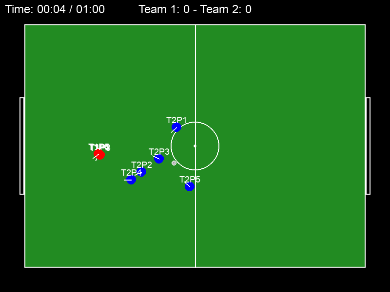
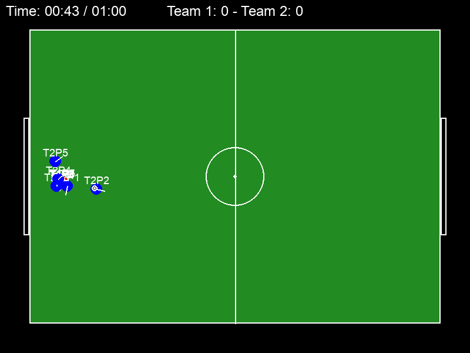
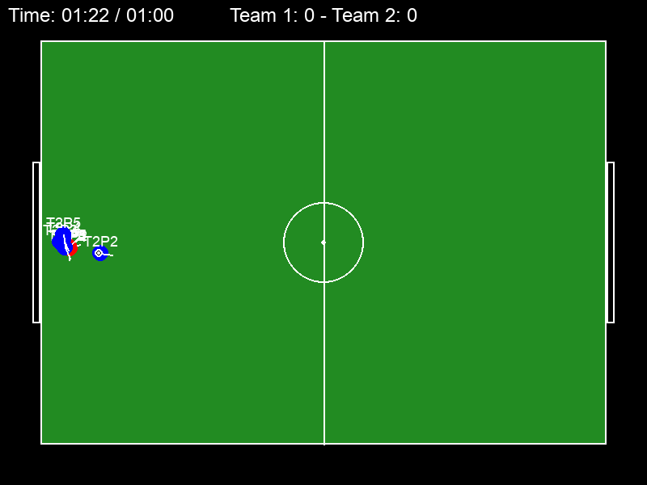

# Match Report — Baseline

| Field | Value |
|-------|-------|
| Date | 2026-07-09 |
| Version | 0.1.0 (`src/__init__.py`) |
| Report type | Baseline / first observation |
| Environment | Python 3.9.6, pygame 2.5.2, numpy 1.26.3 |
| Method | Headless full match via `monitor_match.py` (virtual clock, 60 fps, 90s match) |

## Summary

The first observed match ended **0–0**. Within a few seconds, all ten players
(both teams) collapse into a single clump pinned against the left goal and stay
there for the rest of the match. The ball barely moves, ~2,500 powerless shots
are taken, and no goals are scored. The simulation currently does not resemble a
game of football — it is a static scrum.

## Measured metrics

| Metric | Result | Interpretation |
|---|---|---|
| Final score | **0 – 0** | No goals in a full match... |
| Shots taken | **2,481** | ...despite ~2,500 shot attempts |
| Passes attempted / completed | 13 / ~1 | Almost no passing |
| Possession | T1 **0.0%**, T2 51.4%, free 48.6% | Team 1 *never* holds the ball |
| Ball speed | mean 9 px/s, still **47.6%** of frames | Ball barely moves |
| Team-1 player spread | **6.3 px** avg | All 5 players occupy ~one body |
| Two players overlapping (<15px) | **98.4%** of frames | Everyone stands on everyone |

## Screenshots

**Kickoff (0:04)** — reasonable start, but Team 1's five red players are already
stacked on the same spot (overlapping `T1P...` labels):

**Mid-match (0:43)** — every player from both teams has collapsed into one clump
against the left goal:

**Late (1:22)** — still the same corner scrum, still 0–0:

## Root-cause findings

1. **Ball doesn't stick to the ball carrier.** When `ball.possession` is set,
   nothing moves the ball with the dribbling player (`src/entities.py`). The
   player runs off; the ball stays put.
2. **Shots have ~zero power.** `Player.shoot`/`pass_ball` drain stamina but there
   is no action cooldown, so the AI shoots *every frame* (2,481 times). Stamina
   pins at 0 → `power_factor ≈ 0` → the ball only dribbles a few pixels.
3. **Team 1 gets 0% possession (turn-order bug).** In `GameEngine.update`,
   `team1_ai` runs then `team2_ai`; whoever runs *last* overwrites
   `ball.possession` when near the ball, so Team 2 steals it every frame.
4. **Goal detection can't trigger** because the ball never reaches the line with
   speed (consequence of #1/#2).
5. **No player–player collisions** — 98% overlap.
6. **No real formations/roles** — `role` and `formation` fields exist but all
   outfield players compute nearly the same target and swarm the ball.
7. **Goalkeeper unused** — `is_goalkeeper` exists but no keeper behavior.
8. **Frame-rate-dependent physics** — friction applied as `v *= 0.95` per frame
   regardless of `dt`.
9. **Passing is near-random** (3%/frame) and ignores opponents.
10. **Missing football rules** — no throw-ins, corners, offside, or fouls; every
    dead ball resets to center.
11. **Match length is 90 *seconds*, not minutes**; no half-time or winner handling.

## Prioritized improvement backlog

### Tier 1 — Bugs that break the simulation
- [x] Glue the ball to its carrier until kicked.
- [x] Add a per-player action cooldown; prevent shot power collapsing to zero.
- [x] Resolve possession centrally with a proper tackle/contest (fix turn-order bug).
- [x] Verify goal detection once the ball can actually reach the goal.

### Tier 2 — Positioning & AI realism
- [x] Add circle-based player–player separation (no overlap).
- [x] Implement role-based home positions and hold team shape.
- [x] Only the pressing player chases the ball; others hold zones.
- [x] Under pressure (an opponent chasing too close), the ball carrier should pass to a teammate or shoot if close enough, instead of dribbling into the presser (fixes a ball ping-pong loop after kickoff/goals).

### Tier 3 — Physics & match fidelity
- [x] Make friction/decay `dt`-scaled (frame-rate independent).
- [x] Improve ball physics (rolling friction, max speed, bounce; later spin/curve).
- [x] Decision-based passing (open lanes, pressure, teammate position).
- [x] Add goalkeeper role for one player of each team
- [x] Smarter shooting (aim at open corners, account for keeper/angle/distance).

### Tier 4 — Rules & presentation
- [x] Add out-of-bounds restarts (throw-ins, corners, goal kicks), offside, fouls.
- [ ] Configurable match duration, halves, and end-of-game winner screen.
- [x] Make stamina affect speed and power gradually.
- [x] Visual polish: mark goalkeeper, show possession, HUD stats (possession %, shots).

### Tier 5 — Introducing player controls

Goal: make **Team 1** human-controlled while Team 2 stays on `AIController`.
The human drives one selected outfield player at a time; the other Team 1
players keep their existing AI off-ball behavior (formation shape, defensive
block, support runs). The engine still arbitrates possession, restarts and
rules centrally — the human only supplies movement and actions.

- [x] Control-mode switch: add a flag on `GameEngine` (e.g. `human_team`) that
      routes Team 1 through a human controller instead of `team1_ai`, defaulting
      to CPU so `monitor_match.py` and the headless experiment harness keep
      running all-AI.
- [x] Input layer (`src/input.py`): read an 8-direction movement vector from
      held keys (arrows/WASD) via `pygame.key.get_pressed()`, and edge-trigger
      action buttons (pass, shoot, sprint, switch player) from KEYDOWN events in
      `main.py`. Map raw keys to semantic actions so bindings are rebindable and
      unit-testable without a window.
- [x] `HumanController` for Team 1: move the *selected* player from the input
      vector (reuse `Player.move_towards` acceleration + `speed_factor`) and
      leave all non-selected teammates to the existing AI positioning. Exactly
      one human-controlled player at a time.
- [ ] **Defensive auto-select with manual switch (required):** when Team 1 is
      not in possession, auto-select the outfield player closest to the ball as
      the controlled player (reuse `AIController._nearest_outfield_to_ball`). A
      "switch player" button selects the *second-closest* player, and repeated
      presses cycle through the remaining players ordered by distance to the
      ball. Skip the goalkeeper by default and debounce the switch so one press
      advances exactly one player.
- [ ] Selection follows the ball on attack: when Team 1 gains possession, snap
      control to the ball carrier; after a human pass, hand control to the
      intended receiver so the human keeps controlling the on-ball player.
      - Known bug to fix here (PR #30 Copilot review): `HumanController` hides
        the selected player from the AI by removing it from `team.players`, so
        while the human carries the ball `update_team_state()` reports
        `defense` and teammates defend instead of supporting the attack.
        Replace the roster-removal trick with an `AIController.controlled_player`
        exclusion that keeps the player in the roster (correct team state) but
        skips it in active/support selection, the movement loops, the carrier
        action block, and the keeper update.
- [ ] On-ball actions for the selected player (gated by `Player.can_act()`
      cooldown): pass to the best teammate in the facing cone (reuse
      `Player.pass_ball`), shoot at the opponent goal via `Player.shoot`
      (optionally charge power by button-hold), and sprint (hold to raise speed
      at extra stamina drain via the existing stamina model). Dribbling already
      falls out of `carry_ball`.
- [ ] Selection indicator (`src/ui.py`): draw a distinct marker (e.g. a colored
      arrow above the head) on the human-selected player, visually separate from
      the possession halo and the goalkeeper's gold ring.
- [ ] Goalkeeper policy: keep the GK AI-controlled for the human team by default
      (auto-select and switch skip it); optionally allow explicitly switching to
      the keeper.
- [ ] Fairness: the human-controlled player goes through the same central
      `GameEngine.resolve_possession` contest, restarts, offside and fouls — no
      privileged possession; the human only supplies movement and actions.
- [ ] Controls & docs: keep SPACE (pause), R (reset), ESC (quit); add an
      on-screen legend of the human controls and document the scheme in
      `README.md`.
- [ ] Tests: headless unit tests for the input→action mapping and for the
      defensive auto-select/switch cycling (closest → second-closest → cycle
      back), driving a synthetic engine state so no window is required.

### Tier 6 — Tactical realism (gaps observed)

- [x] Defensive block with lines ("two banks"): defenders and midfielders hold
      flat lines that shift laterally with the ball and compress vertically,
      instead of relying only on man-marking + converge-on-carrier.
- [x] Rest defense: cap how many players push forward in attack; keep 1–2
      defenders (plus keeper) goal-side of the ball during possession so a
      turnover doesn't become an uncontested counter.
- [ ] Transition behavior on turnovers: an explicit counter-attack mode
      (breakout runs into space, fast vertical outlet pass) and a recovery
      mode (sprint goal-side and re-form the block) instead of an instant
      state flip with formation drift.
- [ ] Width and wing play: wide roles that hold the touchline (cap the
      formation slide so width is preserved), overlap runs, and crosses —
      a driven aerial/long pass into the box.
- [ ] Multiple coordinated off-ball runs: beyond the single support runner,
      2–3 simultaneous options (run in behind the line, show to feet,
      third-man rotation), each respecting the offside line.
- [ ] Structured build-up from the back: on goal kicks and deep possession,
      back players spread wide to offer angles and the keeper acts as an
      extra passer; the opponent decides to press high or drop off.
- [ ] Team pressing model: press triggers (backward pass, touchline trap,
      heavy touch) and a block that presses or drops as a unit by zone,
      instead of a permanent single nearest-man press.
- [ ] Penalty-box organization: defenders hold the box edge line and cover
      near/far post zonally; attackers make near-post/far-post/cutback runs
      instead of converging on the ball carrier.
- [ ] Set-piece shapes: dedicated formations for corners and free kicks
      (kicker, box targets, markers or zonal defenders) instead of a generic
      restart possession.
- [ ] Tempo and game-state management: vary decisions by score and clock —
      patient circulation vs. direct play, protecting a lead vs. chasing one.
- [ ] Scale rosters toward 11v11 with a fuller role taxonomy (CB/FB/CM/W/ST)
      once the tactical systems above exist to occupy those roles.

## Next-step recommendation

Start with **Tier 1**. Fixing ball-carrier attachment, shot cooldown/power, and
the possession turn-order bug should be enough to turn this static 0–0 scrum into
an actual flowing match, at which point the next report can measure real
possession balance, shots on target, and goals.
