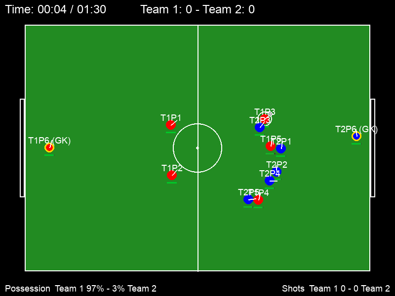
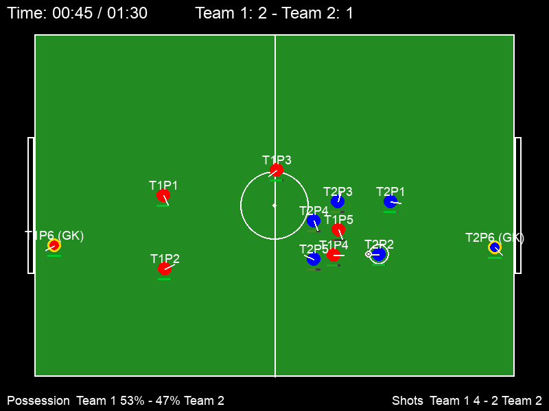
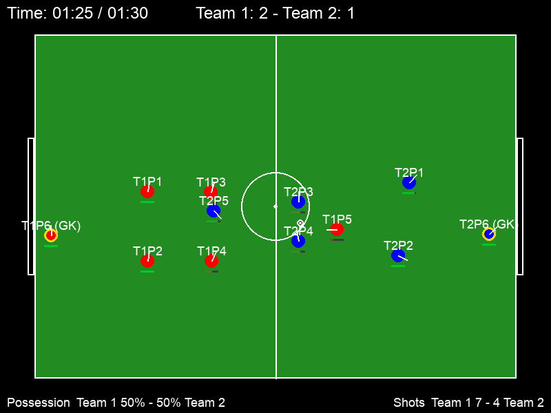

# Match Report — Rebuild

| Field | Value |
|---|---|
| Date | 2026-07-19 |
| Version | 0.2.0 (`src/__init__.py`) |
| Report type | Current-state evaluation / comparison with v0.1.0 |
| Environment | Python 3.9.6, pygame 2.5.2, numpy 1.26.3 |
| Primary method | Seeded all-AI match via `monitor_match.py` (`seed=7`, 16 ms virtual updates, 90-second match) |
| Supporting evidence | 20 seeded all-AI baseline matches from the parameter-sweep harness |

The primary observation is reproducible with:

```bash
python monitor_match.py --seed 7 \
  --output-dir reports/assets/2026-07-19-v0.2.0
```

## Summary

The observed v0.2.0 match ended **Team 1 2–1 Team 2**. The teams produced
12 shots and 66 passes, the ball remained active, and players occupied
recognizable goalkeeper, defensive, midfield, and attacking positions.

This is a qualitative change from v0.1.0. The original report showed a static
0–0 scrum in which nearly every player collapsed into one corner, Team 1 never
held the ball, and 2,481 near-powerless shots were attempted. In v0.2.0:

- possession is resolved once by the engine instead of by controller order;
- the ball follows its carrier and kicks have cooldowns and useful power;
- role-aware shape, defensive banks, marking, rest defence, support runs, and
  goalkeeper behavior organize the teams;
- throw-ins, corners, goal kicks, fouls, and target-selection offside are
  represented;
- one player can be human-controlled while the remaining teammates retain
  tactical AI; and
- a seeded headless evaluation harness can run hundreds of matches quickly.

The engine now behaves as a continuous small-sided football simulation rather
than a static agent scrum. It remains a stylized research and game prototype,
not a calibrated model of real football.

## Measured comparison

The v0.1.0 and v0.2.0 observed columns are single matches. The aggregate column
uses 20 v0.2.0 seeds and is the more reliable estimate of typical behavior.

| Metric | v0.1.0 observation | v0.2.0 seed 7 | v0.2.0, 20 seeds |
|---|---:|---:|---:|
| Final score / total goals | 0–0 / **0** | 2–1 / **3** | **7.05 ± 2.58 goals** |
| Shots | **2,481** | **12** | **14.9 ± 2.5** |
| Passes | 13 attempted / ~1 complete | 66 attempted / 65 complete | 62.4 ± 6.6 / 98.1% ± 1.6 pp |
| Possession | T1 0.0%, T2 51.4%, free 48.6% | T1 29.0%, T2 27.7%, free 43.3% | 3.9 ± 2.7 pp held-ball deviation |
| Moving ball speed | 9 px/s moving mean | 125.1 px/s moving mean | 134 ± 6 px/s moving mean |
| Ball essentially still | **47.6%** | **1.7%** | **0.8% ± 0.5 pp** |
| Team 1 outfield spread | **6.3 px** | **157.5 px** | **152.3 ± 4.5 px** |
| Player overlap | 98.4% under the old severe 15 px threshold | 1.2% under the stricter 20 px threshold | 1.6% ± 1.3 pp under 20 px; none severe |

The seed-7 goals occurred at 5.9, 9.7, and 36.1 seconds. The first two goals
produced an early 1–1 exchange; Team 1 scored the winner before half of the
single 90-second period had elapsed.

Spread is recalculated over five outfield players in every version so the
comparison is like-for-like. The standard v0.2.0 monitor includes the
goalkeeper and reports 189.8 px for the full Team 1 roster in seed 7.

Pass completion is intentionally described as approximate: a pass completes
when its intended receiver is the first player to gain possession after the
kick. The very high completion rate is also a model limitation—AI players veto
blocked lanes before kicking. Defenders chase loose balls, but they do not yet
predict and position themselves to intercept a pass already in flight.

## Screenshots

**Opening phase (0:04)** — both goalkeepers and deeper players remain in their
roles while a local contest develops on the right. Unlike v0.1.0, the whole
roster does not collapse onto the ball:



**Mid-match (0:45)** — Team 1 leads 2–1. Players occupy both halves and multiple
vertical lanes; the nearest players contest possession while teammates retain
shape:



**Late match (1:25)** — the score remains 2–1 and held-ball possession is shown
as 50–50. Both goalkeepers remain positioned near their own goals and the
outfield players are distributed across the pitch:



## v0.1.0 root causes revisited

### Resolved

1. **Ball attachment:** a carrier moves the ball through the shared
   `carry_ball` path until a kick releases possession.
2. **Shot spam and powerless kicks:** actions have cooldowns, kick power scales
   with distance and stamina, and minimum power prevents exhausted zero-power
   attempts.
3. **Controller-order possession bias:** `GameEngine.resolve_possession()`
   arbitrates all eligible players after both controllers update.
4. **Global player stacking:** post-integration disc separation and tactical
   positioning reduce geometric overlap to a small fraction of updates.
5. **Missing shape and roles:** mirrored home positions, an elastic formation,
   a two-bank block, goal-side marking, rest defence, and one support runner
   now organize off-ball movement.
6. **Unused goalkeeper:** each team has a dedicated goalkeeper with line,
   rush, and distribution behavior.
7. **Frame-assumed dynamics:** movement blending, velocity decay, stamina, and
   AI decision gates scale with the measured timestep. Tackle and foul rolls
   remain per-update probabilities.
8. **Random passing:** AI targets are filtered by direction, range, lane
   clearance, openness, pressure, and simplified offside.
9. **Missing restarts and contact rules:** the engine handles throw-ins,
   corners, goal kicks, fouls, tackles, last touch, and restart entitlement.
10. **No human play path:** mixed-control mode now routes one selected player
    through semantic keyboard input while the AI controls the other five.

### Partially resolved

- **Offside:** AI pass selection rejects offside targets, but there is no
  engine-level whistle and human passes do not share the veto.
- **Match structure:** the clock terminates play and the HUD shows elapsed and
  total time, but the match is still one hard-coded 90-second period with no
  halves, added time, or winner presentation.
- **Collisions:** player discs are separated positionally, but tackles and ball
  contact remain abstract rather than fully physical.
- **Goalkeeper control:** a human controls the keeper while it holds the ball,
  but defensive auto-selection and Tab cycling intentionally exclude it.

## New v0.2.0 capabilities

### Tactical AI

- three team states: attack, defense, and free-ball possession;
- phase-aware role assignment for carrier, presser, support, and shape players;
- defensive banks that compress and slide with the ball;
- threat-zone marking and a goal-side spare-defender rule;
- two-player rest defence behind attacks;
- pressure-aware forward and backward passing;
- blocker-aware, angle-gated shooting with distance-scaled noise; and
- goalkeeper positioning, rushing, and distribution.

### Mixed human/AI control

- W/A/S/D or arrow-key movement with normalized diagonals;
- Shift sprinting with the shared stamina model;
- J passing, K shooting, and Tab defensive switching;
- possession-following selection, including an on-ball goalkeeper;
- a cyan selection chevron and on-screen controls legend; and
- the same central possession, cooldown, kick, tackle, foul, and restart rules
  used by autonomous players.

### Evaluation and reproducibility

- deterministic virtual-clock matches with 5,625 updates per match;
- 265 passing automated tests covering mechanics, tactics, rules, UI, and
  mixed-control invariants;
- seeded common-random-number comparisons;
- pass, shot, possession, turnover, restart, speed, spread, and overlap
  instrumentation;
- paired sign-flip permutation tests for parameter effects; and
- a 220-match sweep that runs in under three minutes on the measured machine.

## Remaining limitations

The strongest remaining gaps are:

- no predictive, path-based interception after a pass has been kicked;
- tackle and foul probabilities are not yet rescaled for variable timesteps;
- no explicit counter-attack or defensive-recovery transition state;
- one coordinated support runner rather than multiple complementary runs;
- no width-specific roles, overlaps, crosses, or aerial ball model;
- simplified fouls, offside, and set-piece organization;
- no score-aware tempo, substitutions, halves, or added time;
- raw shot-angle subtraction is not geometrically symmetric between both
  attacking directions; and
- no human-versus-AI balance, usability, accessibility, or latency study.

Long-range shooting is currently load-bearing. In the 20-seed sweep, disabling
probabilistic long shots reduces scoring from 7.05 to 0.85 goals per match.
That result shows that the defensive model is effective, but it also exposes a
lack of coordinated methods for entering the inner shooting zone.

## Recommended v0.3.0 priorities

1. **Reactive pass interception:** let defenders predict and contest the ball's
   path after release, then recalibrate the unusually high completion rate.
2. **Transition states:** add explicit counter-attack and recovery behavior
   instead of switching instantly between static attack and defense policies.
3. **Coordinated chance creation:** preserve width and introduce runs in behind,
   overlaps, cutbacks, and multiple simultaneous passing options.
4. **Shared offside enforcement:** move offside from AI target selection into
   the rules engine so human and AI actions follow one law.
5. **Mixed-control evaluation:** collect human telemetry and playtest
   responsiveness, assistance, difficulty, and goalkeeper handling.
6. **Match structure:** add halves, added time, winner presentation, and
   score-aware decision policies.

## Next-step recommendation

Start with **reactive pass interception plus explicit transition behavior**.
Together they address the two clearest artifacts in the current evidence:
near-perfect safe passing and reliance on long shots to escape organized
defensive blocks. Re-run the 20-seed baseline after each change so v0.3.0 can
distinguish genuine tactical improvement from a redistribution of shots,
turnovers, and free-ball time.
